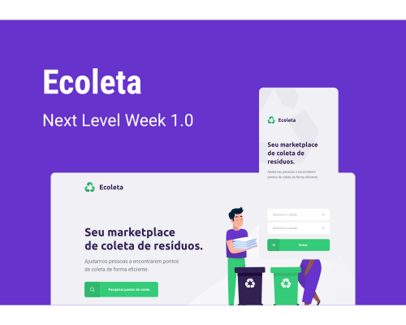

# ♻️  Ecoleta

Uma solução React e React Native, em prol da coleta seletiva de resíduos.



## :sunglasses: Sobre o Projeto


O Ecoleta nasceu da primeira edição da Next Level Week, da [Rocketseat](https://github.com/Rocketseat) e a premissa do projeto é trazer, de forma simples e prática, um jeito de cadastrar  e buscar pontos de coleta seletiva de resíduos, em todo o território nacional.

## :astonished: APi do Ecoleta

A principal api do projeto foi construída *do zero*, utilizando-se totalmente de NodeJS, para isso. Ela fornece um meio de armazenar e consultar dados num banco SQL (a opção escolhida foi o sqlite) e se comunica, também, com a api de localidades, do IBGE, que foi utilizada para obter dinamicamente todas unidades federativas (UF's), bem como seus respectivos municípios.

### :wrench: Recursos
* Principais Recursos
  * TypeScript
  * Nodejs

* Servidor Web
  * express
  * cors

* Banco de dados
  * Knex
  * sqlite3

* Consumo de API
  * axios

* Validação de dados
  * celebrate

* Upload de imagens
  * multer

## :computer: Frontend Web


O frontend do Ecoleta foi inteiramente construído com ReactJS, por ser simples, mas extremamente poderoso. Além do pacote React propriamente dito, foram integrados ao projeto algumas bibliotecas feitas para o mesmo. Dessa forma, foi possível integrar alguns recursos bem interessantes (você vai gostar!)

### :wrench: Recursos

* Principais Recursos
  * ReactJS (com create-react-app)
  * TypeScript

* Consumo da API
  * axios

* Integração de Rotas
  * React Router Dom

* Dropzone, para upload de imagens
  * react-dropzone

* Integração de Mapa
  * Leaftlet
  * React-Leaflet

* Estilização
  * React-Icons

## :iphone: Frontend Mobile


Assim como no frontend web, o React foi escolhido como a principal biblioteca do projeto. Ele foi utilizado em conjunto com a ferramenta Expo, para garantir a presença de um ambiente já configurado, para as plataformas android e ios. Além disso, foram acrescentadas algumas bibliotecas para o React Native, afim de integrar recursos mais avançados e garantir elegância ao resultado ;)

## :wrench: Recursos
* Principais Ferramentas
  * Expo
  * React
  * React Native

* Componentes Avançados
  * React Native Gesture Handler

* Consumo da API
  * axios

* Integração do Mapa e localização
  * react-native-maps
  * expo-location

* Envio de email
  * expo-mail-composer

## :fire: Rodando o projeto

Após fazer o download dos projetos, e se certificar de já possuir a plataforma nodejs instalada em sua máquina, basta digitar:

```bash
# configurar o banco de dados (somente na primeira execução)

cd server
npm run knex:migrate
npm run knex:seed

#  para iniciar qualquer um dos três projetos

cd <nome-da-pasta>
npm install  #  (somente na primeira execução)
npm start
```

*obs: Para utilizar qualquer um dos frontends, é necessário manter a api rodando.*

*obs2: caso o app mobile não esteja se conectando á api, é possível que o ip atual seja diferente do configurado, para isso, basta verificar o console do terminal rodando a api para ver o ip atual e configurá-lo em **mobile/src/services/api.ts***

### últimas notas

#### :wink: Para ajudar o projeto
Se eu consegui te despertar interesse por alguma dessas tecnologias ou assuntos que voçê viu até aqui, peço que contribua com o projeto clicando em *star repository*, mais acima.

#### :rocket: Isso não teria sido possível sem...
Como foi dito acima, todo o projeto foi construído graças à Next Level Week, promovida pelo pessoal da rocketseat, então, se você quer ver mais projetos como esse, além de muito conteúdo sobre desenvolvimento web, eles têm um canal maneiro no [youtube](https://www.youtube.com/channel/UCSfwM5u0Kce6Cce8_S72olg), corre lá!

***

Feito com :sweat_drops: e com :purple_heart: por [Lucas dos Prazeres](https://www.linkedin.com/in/lucas-prazeres-781772182/)
